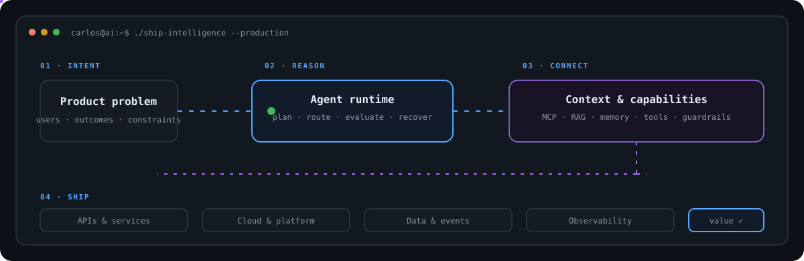

<div align="center">

<picture>
  <source media="(prefers-color-scheme: dark)" srcset="assets/banner-dark.v3.svg">
  <source media="(prefers-color-scheme: light)" srcset="assets/banner-light.v3.svg">
  
</picture>

<br>

<a href="https://github.com/Carlosbil">
  <picture>
    <source media="(prefers-color-scheme: dark)" srcset="https://readme-typing-svg.demolab.com?font=JetBrains+Mono&weight=600&size=25&duration=2500&pause=800&color=58A6FF&center=true&vCenter=true&width=900&lines=Production+AI+%C2%B7+Agentic+Systems+%C2%B7+Cloud;MCP+%C2%B7+RAG+%C2%B7+Context+Engineering;Building+AI+systems+that+actually+ship">
    <source media="(prefers-color-scheme: light)" srcset="https://readme-typing-svg.demolab.com?font=JetBrains+Mono&weight=600&size=25&duration=2500&pause=800&color=0969DA&center=true&vCenter=true&width=900&lines=Production+AI+%C2%B7+Agentic+Systems+%C2%B7+Cloud;MCP+%C2%B7+RAG+%C2%B7+Context+Engineering;Building+AI+systems+that+actually+ship">
    
  </picture>
</a>

<br>

### I design and ship AI systems that connect models, knowledge and real-world tools.

<a href="https://www.linkedin.com/in/carlos-bilbao-lara/"></a>&nbsp;
<a href="mailto:carlosbilbao2@gmail.com"></a>&nbsp;
<a href="https://github.com/Carlosbil"></a>

<br><br>


</div>

---

## this is me :)

Hi, I'm **Carlos**, an AI engineer and software lead building from Madrid, Spain 🇪🇸.

- 🚀 **AI & Software Lead at Lognext** — production AI, architecture and AI-assisted engineering.
- 🤖 Building **agentic systems** with MCP, RAG, context engineering, evaluation and tool use.
- 🛠️ Backend and platform-minded: **Python, Java, APIs, distributed systems, Docker, Kubernetes and cloud**.
- 🧬 **PhD Candidate in Artificial Intelligence**, researching distributed neuroevolution.
- 🎾 Off-screen you'll usually find me playing **tennis or padel**.

> I care about the part after the demo: reliability, integration, observability and measurable value.

<br>

<div align="center">

## how I build AI systems

<picture>
  <source media="(prefers-color-scheme: dark)" srcset="assets/architecture-dark.v1.svg">
  <source media="(prefers-color-scheme: light)" srcset="assets/architecture-light.v1.svg">
  
</picture>

<sub>Intent → reasoning → context & capabilities → production value</sub>

</div>

---

<div align="center">

## production AI stack


<br>


<br><br>


<br><br>

<sub>AI systems · backend · cloud · data · distributed infrastructure</sub>

</div>

---

<div align="center">

## selected work

</div>

<table>
<tr>
<td width="50%" valign="top">

### 🧬 [Neuroevolution IPYNBs](https://github.com/Carlosbil/Neuroevolution-ipynbs)

Hybrid neuroevolution research for **Parkinson's voice classification** with evolvable Conv1D networks, parallel 5-fold validation and multi-objective Pareto selection.

`Python · PyTorch · NEAT · Research`

</td>
<td width="50%" valign="top">

### 🌐 [Distributed Neuroevolution](https://github.com/Carlosbil/Neuroevolution)

A Kafka-based distributed system that evolves, trains and evaluates neural architectures through independent services and workers.

`Python · Kafka · Docker · Distributed AI`

</td>
</tr>
<tr>
<td colspan="2" valign="top">

### 🎮 [Agent Files Game](https://github.com/Carlosbil/agent-files-game) · in progress

A gamified, installable learning experience for understanding AI workflows: agents, skills, hooks, instructions, memory, context and token cost.

`Agentic AI · Developer Education · Flutter · Product`

</td>
</tr>
</table>

---

<div align="center">

## signals

<table>
<tr>
<td width="50%" align="center" valign="middle">

<picture>
  <source media="(prefers-color-scheme: dark)" srcset="assets/radar-dark.v2.svg">
  <source media="(prefers-color-scheme: light)" srcset="assets/radar-light.v2.svg">
  
</picture>

</td>
<td width="50%" align="center" valign="middle">

<picture>
  <source media="(prefers-color-scheme: dark)" srcset="assets/radar-langs-dark.v2.svg">
  <source media="(prefers-color-scheme: light)" srcset="assets/radar-langs-light.v2.svg">
  
</picture>

</td>
</tr>
</table>

</div>

---

<div align="center">

## numbers matter? sometimes they do.

<picture>
  <source media="(prefers-color-scheme: dark)" srcset="assets/card-stats-dark.v3.svg">
  <source media="(prefers-color-scheme: light)" srcset="assets/card-stats-light.v3.svg">
  
</picture>

<br>

<sub>Snapshot · September 2026</sub>

</div>

---

<div align="center">

## research mode: ON 🧬

</div>

My PhD work explores whether neural architectures can evolve efficiently across distributed infrastructure.

```text
population ──► mutate / crossover ──► distributed workers
     ▲                                        │
     └──────────── next generation ◄── fitness┘
```

**Current research signals:** neuroevolution · NEAT · neural architecture search · distributed AI · event-driven systems

---

<div align="center">

### Let's build AI that survives contact with production.

Open to conversations about **production AI, agentic architecture, MCP ecosystems and distributed AI research**.

<br>

<sub>` Build · Break · Learn · Repeat · @Carlosbil `</sub>

</div>
